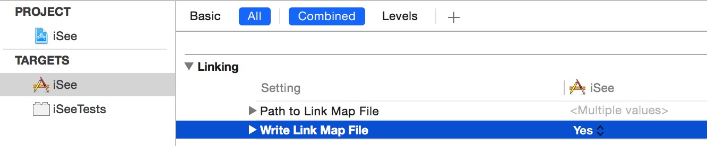
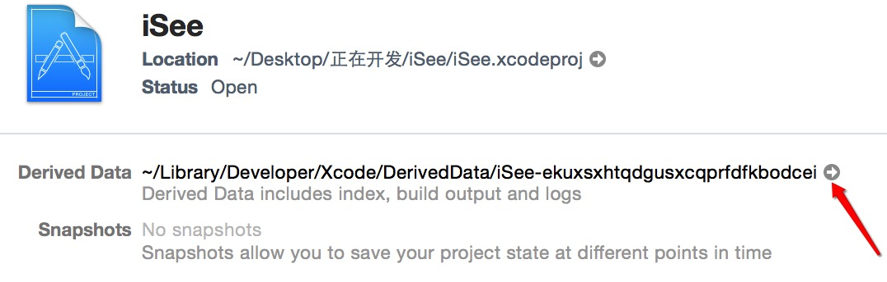
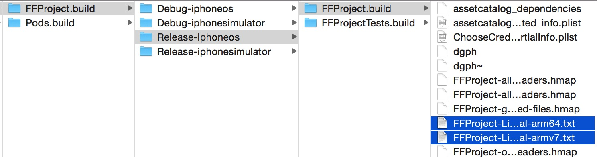
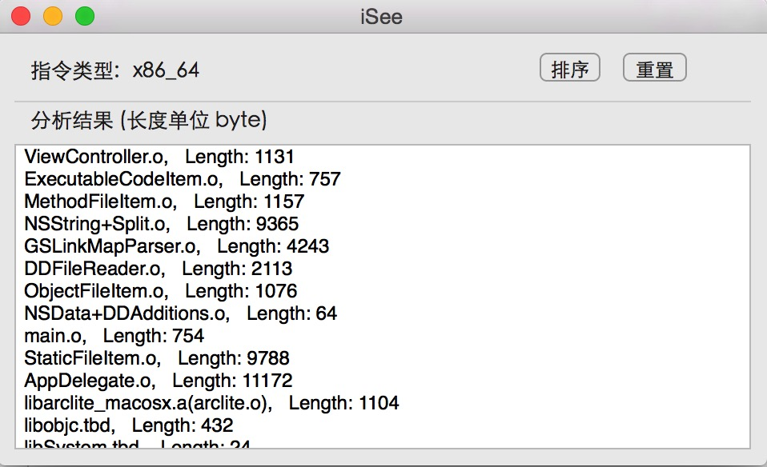

##iOS包大小分析工具 iSee   

###简介  
===     
   iSee是一款分析iOS可执行文件成分的工具，通过加载XCode在项目编译期间产生的linkMap文件，能够输出项目中每个类(包括第三方静态库)，在最终可执行文件中占用的长度信息。

###使用方法   
===   
####1.在XCode编译选项中打开"WriteLinkMapFile"  
     

####2.选择好真机/模拟器,Debug/Release。编译项目,进入项目的Derived Data目录   
   

####3.依次进入Build/Intermediates/项目名.build/  目录, 找到相应模式下的编译产物文件夹  
   

####可以看到一个名为 项目名-LinkMap-normal-CPU架构.txt的文件    

####4.用iSee打开上面的文件,完成 

